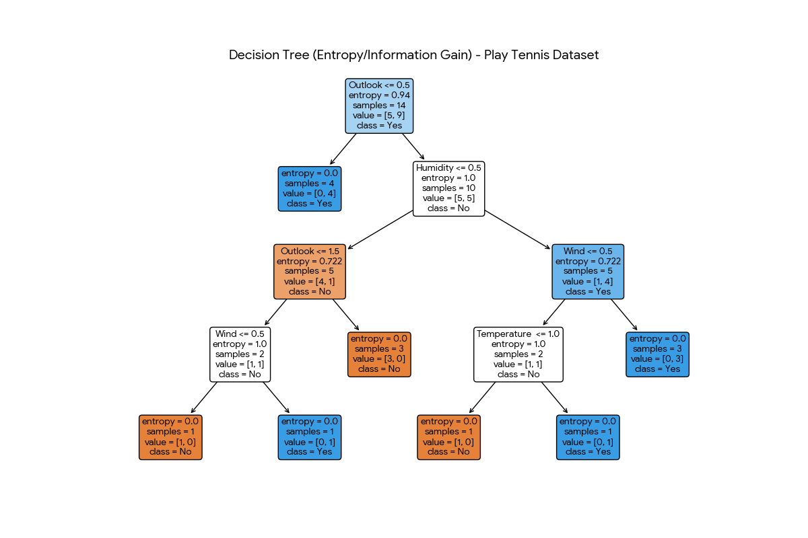

# Decision Tree Classifier: Play Tennis
A machine learning project that uses **Entropy** and **Information Gain** to predict whether to play tennis based on weather conditions.

## Project Overview
This project demonstrates the implementation of a Decision Tree algorithm using Python's `scikit-learn` library. It calculates Information Gain to determine the best splitting features (Outlook, Humidity, etc.).

## Key Features
- **Mathematics:** Uses Entropy to measure data impurity.
- **Visualization:** Generates a visual flowchart of the decision-making process.
- **Data:** Uses a standard CSV format for easy modification.

## How to Run
1. Install requirements: `pip install pandas scikit-learn matplotlib`
2. Run the script: `python main.py`

## Visualization

